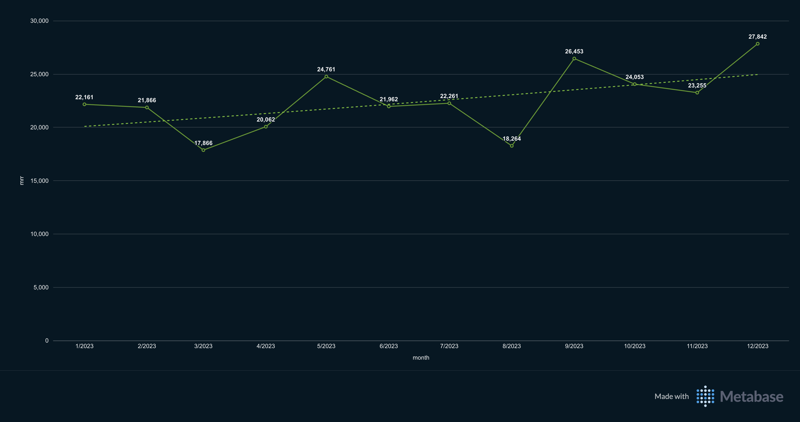
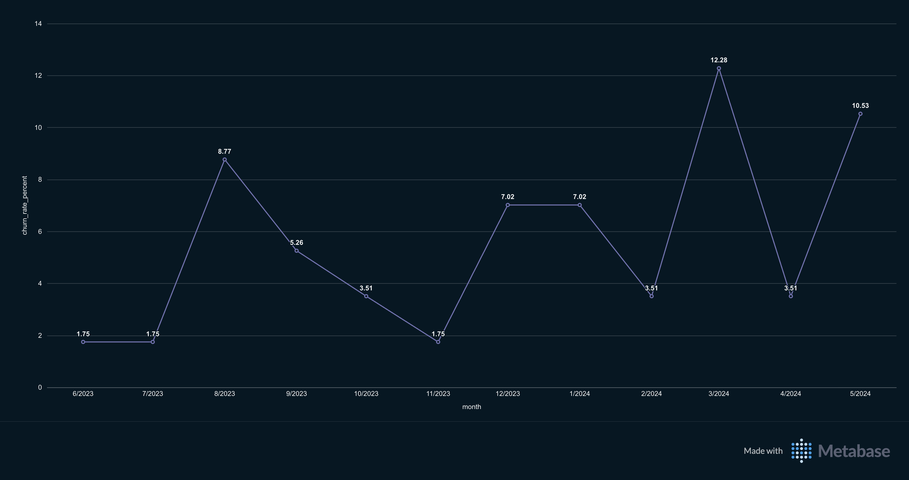
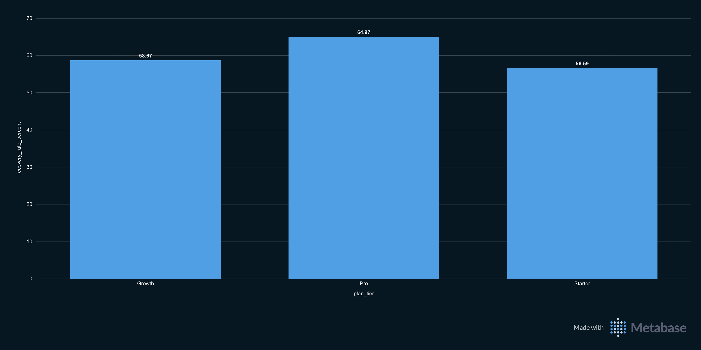
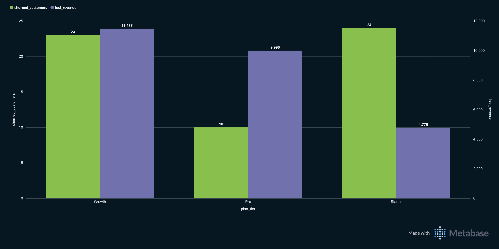

# TitanTrack Revenue & Retention Analytics Dashboard

**Stack:** PostgreSQL (Supabase) · Metabase · SQL  
**Data Range:** January 2023 – May 2024  
**Dataset:** 500 synthetic customers · 5 tables · 14,000+ rows


## About This Project

TitanTrack is a fictional home services SaaS platform modeled after ServiceTitan, serving HVAC, roofing, plumbing, and electrical contractors across three plan tiers: Starter, Growth, and Pro.

I built this project as a portfolio piece to demonstrate real-world data analytics skills, moving into genuine business problem solving. I'm a data analytics student actively transitioning from a no-code automation background (n8n, Make, GoHighLevel) into analytics, and this project represents that shift: from building workflows to asking business questions and finding answers in data.

The central question this dashboard answers:

> **Where is this SaaS company losing money and what can be done about it?**


## The Business Questions

Each query was built around a specific question a real SaaS operator would need answered:

| # | Business Question | Query |
|---|---|---|
| 1 | Is revenue growing or declining? | MRR by Month |
| 2 | Are we losing customers and how fast? | Churn Rate by Month |
| 3 | When payments fail, are we recovering the money? | Failed Payment Recovery by Plan Tier |
| 4 | Which plan tier is bleeding the most revenue? | Revenue Leakage by Plan Tier |
| 5 | Which customers are most likely to churn next? | At-Risk Customer Identification |


## Key Findings

**MRR — Stable but volatile**  
Monthly recurring revenue ranged from $17,866 to $26,453 throughout 2023 with an upward overall trendline. Month-to-month swings of 20–30% suggest new customer acquisition was being offset by inconsistent churn — making retention the core issue to investigate.

**Churn — Unpredictable spikes, not seasonal bleed**  
Churn held between 1.75–3.51% for most months, but spiked to 8.77% in August 2023 and 12.28% in March 2024. Non-seasonal spikes are more dangerous than consistent churn — there's no predictable trigger to fix.

**Failed Payment Recovery — A systemic ceiling**  
Recovery rates were nearly identical across all plan tiers: Growth 58.67%, Pro 64.97%, Starter 56.59%. The consistency reveals the problem isn't tier-specific, it's a systemic gap in the dunning process leaving 35–43% of failed payments unrecovered across the entire customer base.

**Revenue Leakage — Growth tier is the priority**  
Growth tier lost the most total revenue at $11,477 across 23 churned customers ($499/customer). Pro tier lost $9,990 across only 10 customers ($999/customer). Growth is the worst of both worlds — high churn volume combined with meaningful contract value — making it the highest-ROI target for a retention intervention.

**At-Risk Customers — Moving from reactive to predictive**  
231 customers flagged as at-risk across all tiers. 21 customers meet critical risk criteria: 10+ open support tickets AND average feature usage below 5.0, indicating simultaneous frustration and disengagement. Growth tier carries the highest at-risk volume (85 customers). 14 customers are severely disengaged with feature usage below 4.0, including 3 Pro-tier accounts representing the highest individual revenue exposure.


## Dashboard Screenshots


*MRR held between $17,866–$26,453 throughout 2023 with an upward trendline despite monthly volatility.*


*Churn spiked to 12.28% in March 2024, the highest recorded rate. Non-seasonal pattern indicates no single fixable trigger.*


*Recovery rates consistent across tiers (57–65%), revealing a systemic dunning gap rather than a tier specific problem.*


*Growth tier leads in total lost revenue ($11,477) despite Pro customers having nearly 2x the individual contract value.*


## SQL Queries

All queries are in the `/queries` folder. Each file is named and commented to explain the business logic behind it.

```
queries/
├── 01_mrr_by_month.sql
├── 02_churn_rate_by_month.sql
├── 03_failed_payment_recovery.sql
├── 04_revenue_leakage_by_plan_tier.sql
└── 05_at_risk_customers.sql
```


## Data Model

Five tables in PostgreSQL via Supabase:

| Table | Rows | Description |
|---|---|---|
| `customers` | 500 | Company name, industry, plan tier, signup date |
| `subscriptions` | 500 | Plan tier, MRR, status, churn date |
| `payments` | ~5,865 | Payment attempts, status, recovery flag |
| `usage` | ~5,787 | Monthly login count, features used per customer |
| `support_tickets` | ~1,549 | Open ticket count per customer |

Synthetic dataset generated in Python with realistic patterns including usage decay before churn and payment recovery flags.

## Sample Dataset

The at-risk customer dataset used for Query 5 is included in the `/data` folder.

`data/at_risk_customers_may_2024.csv`

Contains 231 flagged active customers with the following fields:
- `customer_id` — unique identifier
- `company_name` — business name
- `industry` — HVAC, roofing, plumbing, or electrical
- `plan_tier` — Starter, Growth, or Pro
- `avg_logins` — average monthly login count
- `avg_features` — average features used per month
- `open_tickets` — count of unresolved support tickets

Use this dataset to reproduce the at-risk segmentation analysis or build on it further.

## Data Notes

- January 2024 MRR excluded from trend chart, partial month at dataset boundary
- June 2024 churn excluded from trend chart, partial month producing artificially inflated rate
- At-risk customer list exported May 5, 2026 and reflects point in time snapshot


## Tools Used

- **Supabase** — PostgreSQL database hosting and SQL editor
- **Metabase** — Business intelligence and dashboard visualization
- **SQL** — All analysis written in PostgreSQL-flavored SQL
- **Python** — Synthetic dataset generation

## About Me

I'm a data analytics student completing a formal certificate while building real projects to bridge into a full-time analytics role. My background is in no-code automation (n8n, Make, GoHighLevel) and I'm actively developing SQL, database, and BI skills to complement that foundation.

I built TitanTrack to prove I can take a business problem, translate it into analytical questions, write the queries, and communicate the findings, not just run a tool.

**Open to data analytics internships and entry-level analyst roles.**

- 📧 aidenjbanuelos@outlook.com
- 💼 [linkedin.com/in/aiden-banuelos-60b0b6276](https://www.linkedin.com/in/aiden-banuelos-60b0b6276)
